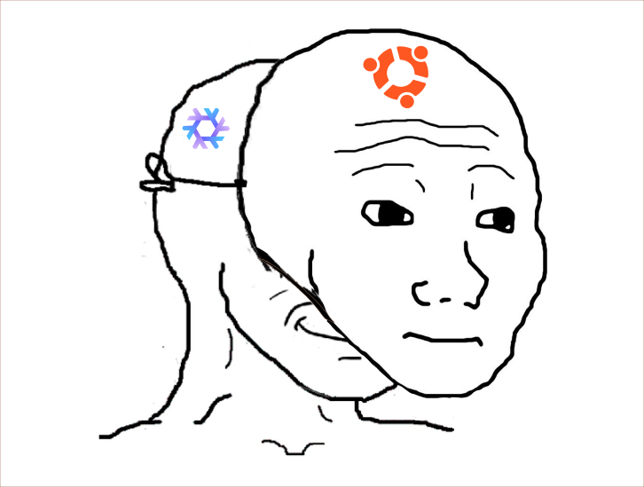
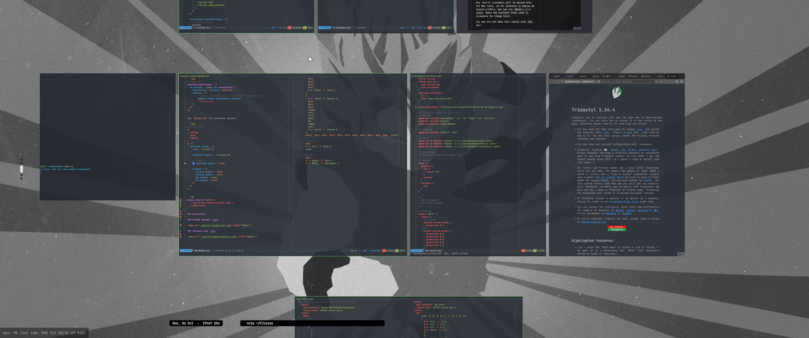
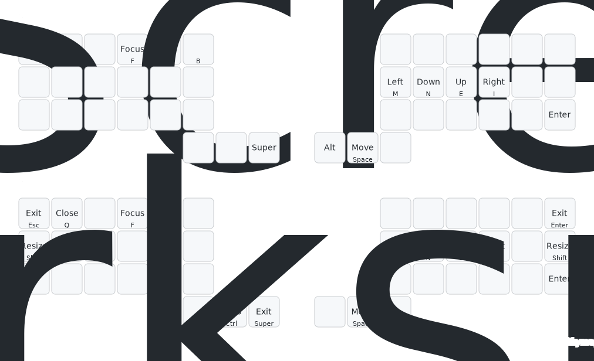

# normal.nixos - A banal desktop configuration.

A set of **nixos modules** which provide reasonable configuration
for desktop.

Still for **paranoids** and **hypochondriacs**.



These are my public dots.

I do not recommand installing
as everything is largely opinionated
and still moving.

## Modules

No complicated dependencies here.

You may **copy files** right onto your own configuration
and adjust to your needs.

### Safer browsing

This project aims to provide a reasonable NixOs base configuration
for desktops with:

- Firefox - A custom firefox with security features.
  - Tridactil (keyboard navigation)
  - (+ i2p profile)
- Searxng - A local search engine aggregator without metadata.

### Password and Keys management

- KeepassXC (+ custom security centric layout)

### Keyboard centric

With a keyboard centric workflow under **Colemak-DH**.
Mouse support but no mouse needed.

- Window manager: Niri (+ Mudras)
- Shell: Fish (+ vim keybindings)
- Text editor: Nvim (NvChad)

## Installation and Usage (Flake)

Add the repo url to your flake inputs.

```nix
# flake.nix
inputs = {
  normal = {
      url = "github:pipelight/normal.nixos";
  };
};
```

Add the module to your system configuration.

```nix
# flake.nix
nixosConfigurations = {
  my_machine = pkgs.lib.nixosSystem {
    specialArgs = {inherit inputs;};
    modules = [
        # Import the module and the related configuration file.
        inputs.normal.nixosModules.default
        ./normal.nix
    ];
  };
};
```

See `option.nix` for available options.

```nix
# normal.nix
{
  config,
  pkgs,
  inputs,
  ...
}: {
  services.normal = {
    users = ["anon"];

    keyboard.layout = "colemak-dh";

    # Graphical
    wm.hyprland.enable = true;

    browser = {
      firefox.enable = true;
      searxng.enable = true;
      i2p.enable = true;
      tor.enable = true;
    };
  };
}
```

```sh
nixos-rebuild switch \
  --log-format multiline-with-logs \
  --show-trace
```

## Keyboard bindings

### Window manager(Niri)





## Todo

### Keyboard (3x6+3)

<!--  -->

### Text editor(Nvim)
